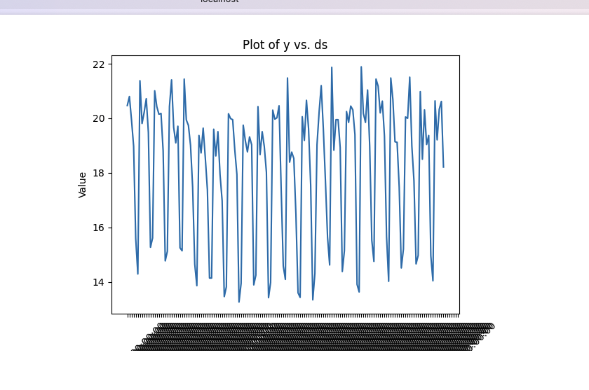

# Getting started with pyodide in React

This repository serves as a template for using pyodide in React. It was created using `create-react-app`.

## Quickstart
Only support *Nodejs 16.0.0*

To get started, simply run the lines below in your terminal:
```
cd react-pyodide-template
npm i
npm start
```

When you are ready, you can serve the production build:
```
npm i -g serve
serve -s build
```


## Available Scripts

In the project directory, you can run:

### `npm start`

Runs the app in the development mode.\
Open [http://localhost:3000](http://localhost:3000) to view it in the browser. (Take time please wait about 5 seconds)




## Acknowledgement

This project was bootstrapped with [Create React App](https://github.com/facebook/create-react-app).

You can learn more in the [Create React App documentation](https://facebook.github.io/create-react-app/docs/getting-started).

To learn React, check out the [React documentation](https://reactjs.org/).
